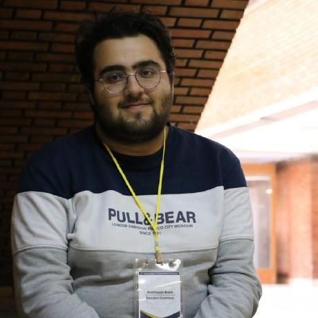

# Alternative GitHub Pages style for Amirhosein Amini

This version uses a dark academic layout with a left sidebar and a more distinctive visual identity.

## To use your real photo

1. Put your headshot in `assets/`.
2. Name it `profile-photo.jpg`.
3. In `index.html`, replace:

```html

```

with:

```html

```

## To deploy

Copy these files into your existing GitHub Pages repo folder, then run:

```bash
git add .
git commit -m "Switch to alternate site style"
git push
```
